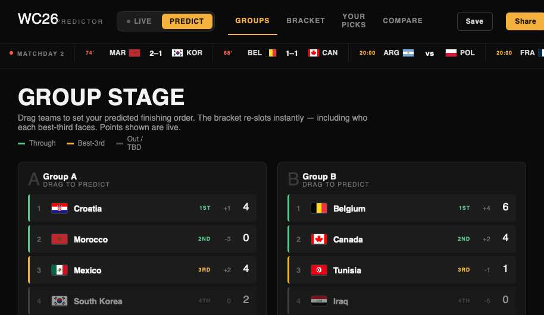
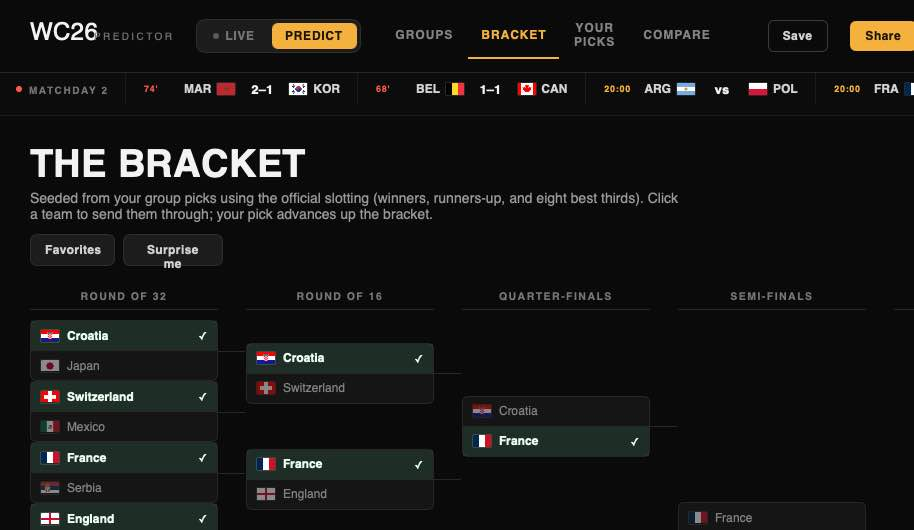

# WC26 Predictor

A World Cup 2026 bracket predictor. Drag teams to set your predicted group order, watch the
48‑team bracket re‑slot instantly (including who each best‑third faces under FIFA's official slotting),
pick every knockout winner up to the champion, and compare your picks against the **live** group
standings as real results come in.




## What it does

- **Group stage** — drag to predict each group's finishing order. Points and goal difference are live.
- **The bracket** — Round of 32 → Final, seeded from your group picks using the real FIFA 2026 match
  tree (matches 73–104). The eight best third‑placed teams are ranked across all 12 groups and matched
  to their pre‑assigned slots (a backtracking assignment that respects each slot's allowed groups and
  never pits a winner against their own group's third) — and in Predict mode you can **drag that
  third‑place ranking into any order you like**, with the bracket re‑seeding instantly. Click a team to send it through.
- **Your picks** — predicted champion, runner‑up, a Golden Boot pick, save to your device, and a
  downloadable share card (PNG).
- **Compare** — your predicted finishing order vs. the live standings, scored by exact positions,
  qualifiers, and group winners.
- **Live / Predict** toggle and a scrolling results ticker.

## Live data

Results come from the public‑domain [**openfootball/worldcup.json**](https://github.com/openfootball/worldcup.json)
dataset — no API key, served with permissive CORS, so the browser fetches it directly. There is **no
backend and no scheduled job**: the page pulls the latest `2026/worldcup.json` (+ `worldcup.teams.json`)
on load and on the ⟳ refresh button, computes points / goal difference / standings from full‑time scores,
and feeds them into the standings sort, the best‑third ranking, and the bracket seeding.

If the feed is unreachable, the app falls back to an embedded snapshot so Predict mode always works
offline. The data seam lives in `fetchLiveData()` in `index.html`; swapping in a different or real‑time
source only means changing that one method.

## Run locally

It's a static site — any static server works:

```bash
python3 -m http.server 8000
# open http://localhost:8000
```

## Project structure

```
index.html      The app: inline UI template + logic (the predictor, bracket math, live-data seam)
support.js      The runtime that compiles the template and renders it with React (from a CDN)
screens/        Screenshots
docs/           Design spec
```

`index.html` is a Claude "Design Component": `support.js` loads React/ReactDOM (pinned, with SRI),
parses the inline `<x-dc>` template, and compiles its `{{ }}` / `sc-for` / `sc-if` bindings into a live
React app driven by the `class Component extends DCLogic` script at the bottom of the file.

## Deploy

Hosted on GitHub Pages straight from `main` (root). `.nojekyll` keeps Pages from running Jekyll.
Because the live feed is fetched client‑side, the deploy is one‑time and the data stays current on its own.

## Credits

- Match data: [openfootball/worldcup.json](https://github.com/openfootball/worldcup.json) (public domain).
- Flags: [flagcdn.com](https://flagcdn.com).

## License

MIT — see [LICENSE](LICENSE).
